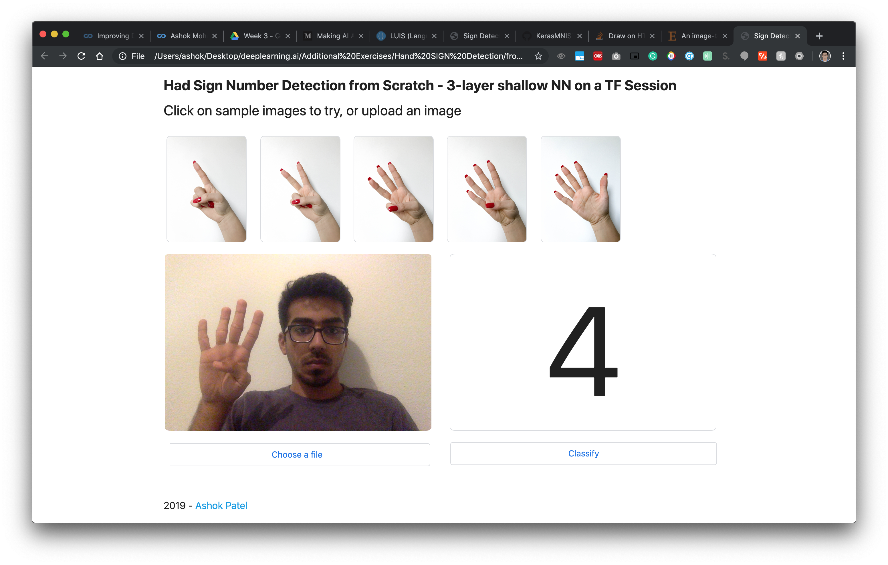
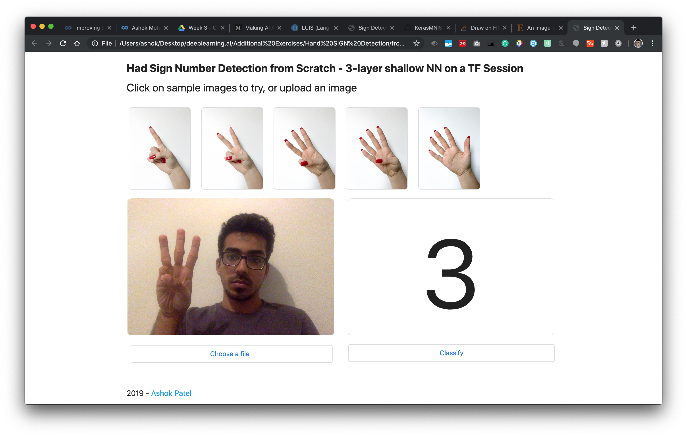

# Hand Sign Recognition - Numbers 
## 3-layer shallow network trained on a TF Session
------
### Content
* model.py - preprocessing data, creating placeholders, init params, forward prop, computing loss, and updating params
* utils.py - helper functions for model training
* predict.py - image preprocessing and prediction

### Performance
Over 2000 epochs on mini-batch ADAM Optimizer:
```
Train Accuracy: 0.999074 
Test Accuracy: 0.7333335 
```
(Model clearly overfits but works reasonably well, possible reasons - shallow nature, not enough data (1080 samples))

### Usage
Train
```
$ python3 model.py num_epochs learning_rate minibatch_size
```
Classify
```
$ python3 predict.py '/path-to-img/img'
```
### Sample tests

